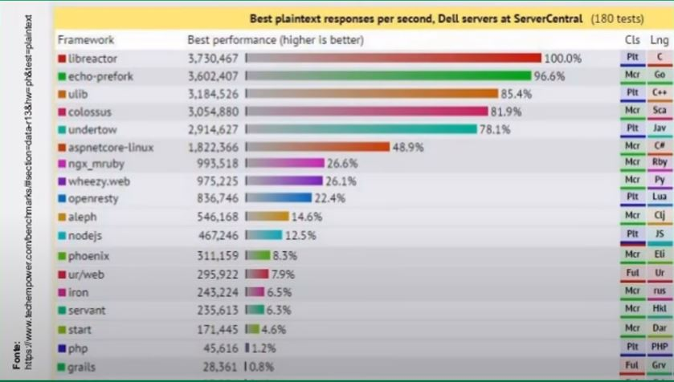

# O que é Node.JS

##### A definição mais simples é:
    
- É um interpretador JavaScript que não depende do navegador,  ou seja, ele é totalmente desvinculado ao navegador.

##### Bases do Node:

- V8 - motor javascript da google que está presente dentro do google Chrome, ele é responsável por entender o javascript.

- libuv - é uma bibilioteca que deu características de uma liguagem backend para o Node, ou seja, você consegue se conectar com um banco de dados por exemplo, por conta dessa libuv.

##### Vantagens 

- Muito leve, pouco uso de memória Ram, melhor aproveitamento da cpu.

- Utiliza Javascript

- Tem um dos maiores  ecossistemas de bibliotecas, módulos e plug-ins do mundo.

Empresas como Netflix, ebay, Microsoft, paypal, UBER, utilizam o NodeJS.